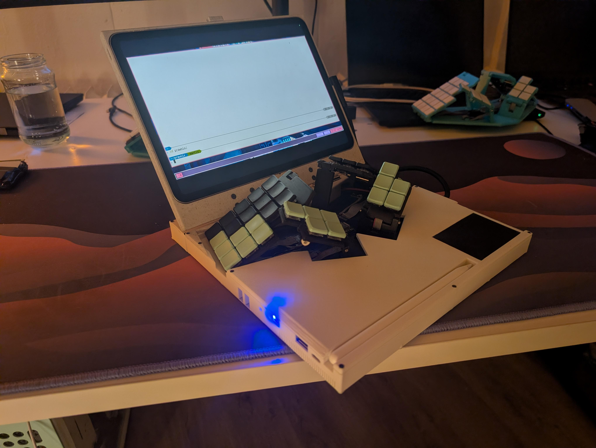
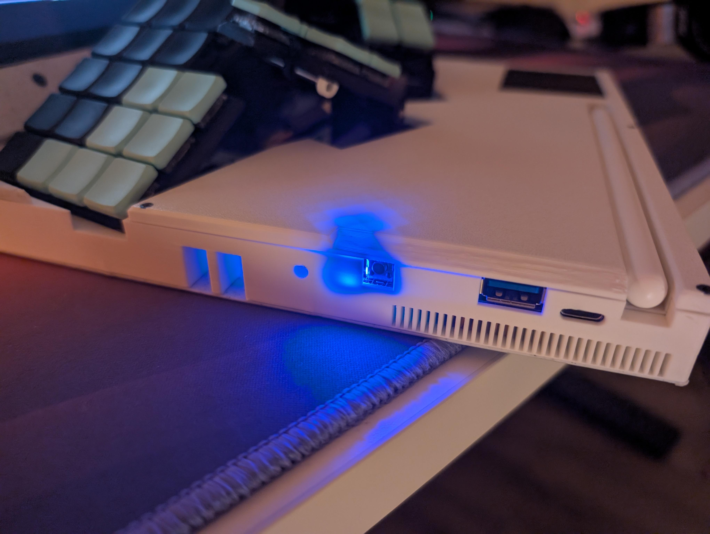
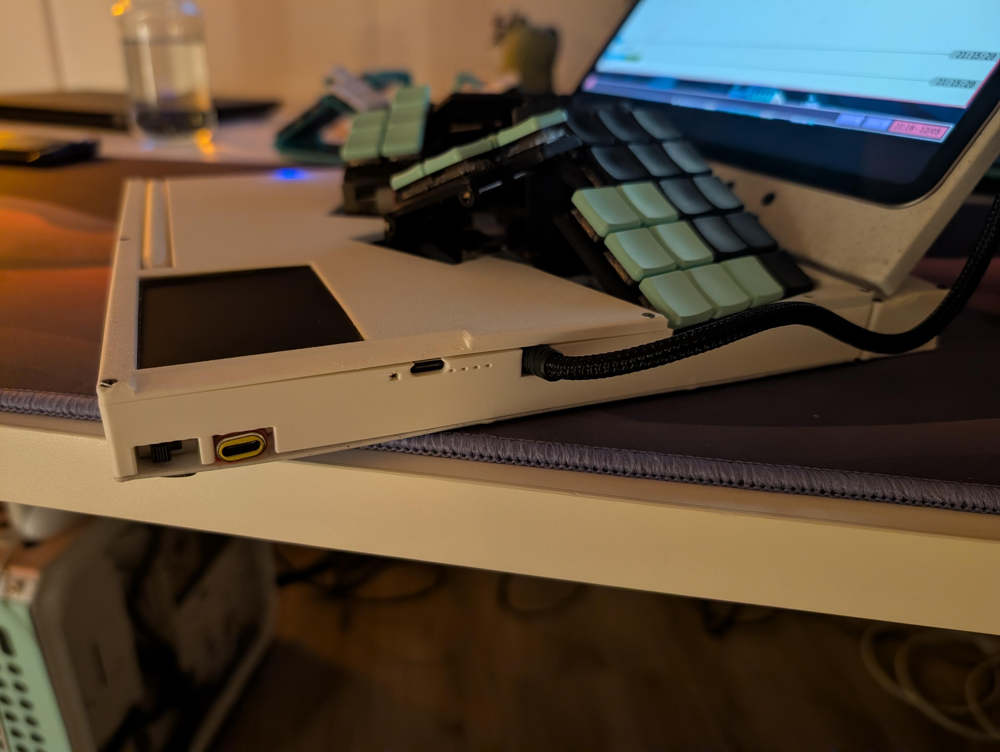
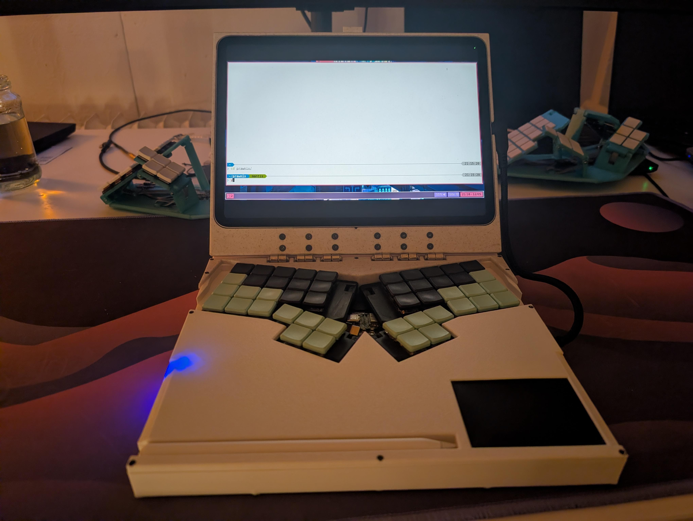
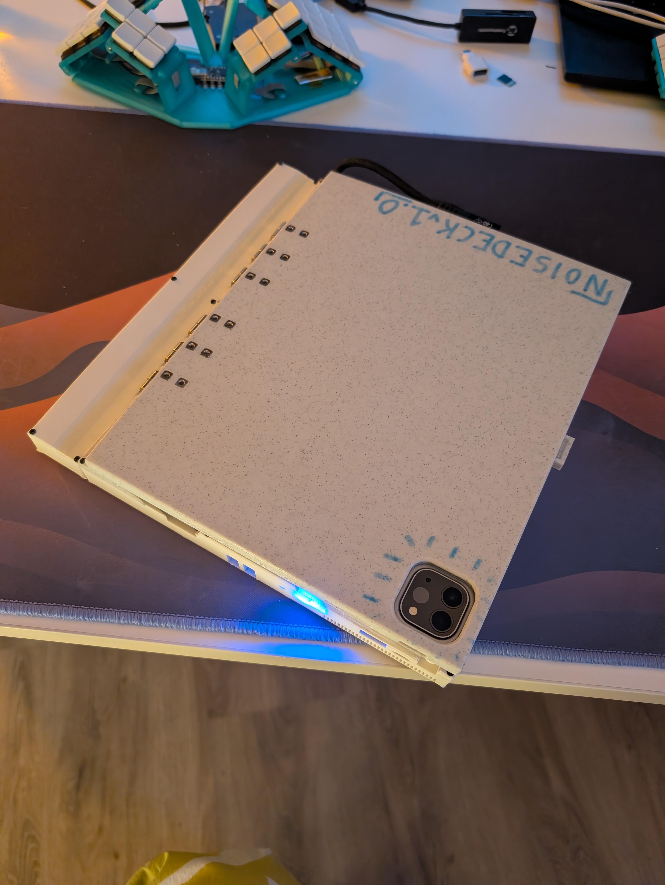

# noisedeck

a cyberdeck for dealing in noise
runs [prawnix](http://github.com/SolidEva/prawnix)

## v2

### features
- rk3588s SBC (firefly roc-rk3588s-pc)
- btrfld keyboard
- trackpad
- ipad: magnetically mounted acting as screen via usbc hdmi capture card
- 1x usb c data port
- 2x usb c charge port (one for ipad, other for main battery, supports usbc power delivery!)
- 1x usb a 3.0 port
- ipad pencil and charging cradle

### parts
ipad :p

btrfld keyboard: https://github.com/SolidHal/btrfld

rk3588s SBC: https://en.t-firefly.com/product/industry/rocrk3588spc#spec

hinges:
https://www.amazon.com/gp/product/B0BFWNJMCY/

hinge fasteners:
M3x16
M3 threaded, DIN 562 flat square nuts: https://www.amazon.com/M3nS-Printers-Stainless-Conform-Quantity/dp/B0BD2N9KTV

power switches:
https://www.amazon.com/dp/B075RC6TFB

apple pencil charging cradle:
https://www.amazon.com/Paiholy-Compatible-Generation-Lightweight-Convenient/dp/B0BMB7362T

midcase fasteners (plastic to plastic):
m2x5 and m2x6 tapered flat head self taping screws

cheap ipad magnetic folio case, torn apart to make the ipad mount

usbc right angle extension: https://www.amazon.com/dp/B0B71BZ4YF

battery & charging:
- 3x 18650s
- 3s BMS: https://de.aliexpress.com/item/1005006064385669.html
- usbc PD IP2369 based  battery charger board: https://de.aliexpress.com/item/1005008766304319.html
- XT30 plugs

cooling:
- fan: https://www.digikey.de/en/products/detail/wakefield-thermal-solutions/DB0620505H1A-BT0/12610355
- heatsink: https://www.digikey.de/en/products/detail/advanced-thermal-solutions-inc/ATS-1108-C1-R0/4146489
- screws, m3x5mm for heatsink, m2 for fan

video:
- a flat HDMI cable like: https://www.amazon.de/dp/B01787KZVG
- usbc 1080p hdmi capture card with usbc power delivery (lets us charge the ipad while in use): https://www.amazon.de/dp/B0DQDC3H46
- 4in usbc extension, for ipad power delivery, like https://www.amazon.com/dp/B0CSJMCCXW

- 4 port usb hub pcb: https://www.adafruit.com/product/5997

- mnt reform trackpad: https://shop.mntre.com/products/mnt-reform-capacitive-trackpad-module

### Assembly Notes

- glue eyeglass nosepads to bottomcase for feet
- hinges need to be filed/ground shorter on the side that would otherwise stick out through the bottom case
- cleaning out the hinge holes in the ipad enclosure is annoying. Recommend using a 46 gauge drill bit
- tear down the ipad folio case to just the parts required to hold the magnets in place. lets call this the "case core"
  - attach a thin film to the side of the case core that magnetizes to the ipad
  - superglue the case core into the ipad enclosure so that the ipad is held into the ipad enclosure magnetically

- battery wiring
    - so the schematic is cells --> BMS <----> ip2368
                                       |
                                    controller

more notes in build_notes.md

# V1

a cyberdeck for dealing in noise, v1

## features
- btrfld keyboard
- trackpad
- headphone jack
- mic jack
- 1x usb c data port
- 1x usb c charge port
- 1x usb a port
- ipad: magnetically mounted
- ipad pencil and charging cradle
- rpi zero 2 w + 5000mah battery

future:
- extra keys in topcase for common hotkeys(?)
- choc key one octave keyboard in topcase(?)
- pitch joystick/wheel that snaps back to the center

the rpi zero 2 w is ran so its usb is in gadget mode, so it tells the ipad it is an ethernet device.
with this you can setup a local network and ssh directly from the ipad to the rpi without using wifi
this leaves the wifi chipset useful for other things

## parts
hinges:
https://www.amazon.com/gp/product/B0BFWNJMCY/

hinge fasteners:
M3x8 countersunk fasteners: https://www.amazon.com/HanTof-Countersunk-Machine-Wrenches-Threaded/dp/B0B9HWVV61
M3x10 countersunk fasteners
M3 threaded, DIN 562 flat square nuts: https://www.amazon.com/M3nS-Printers-Stainless-Conform-Quantity/dp/B0BD2N9KTV

power switches:
https://www.amazon.com/dp/B075RC6TFB

apple pencil charging cradle:
https://www.amazon.com/Paiholy-Compatible-Generation-Lightweight-Convenient/dp/B0BMB7362T

midcase fasteners (plastic to plastic):
m2x5 and m2x6 tapered flat head self taping screws

cheap ipad magnetic folio case

btrfld keyboard: https://github.com/SolidHal/btrfld

usbc to 3x usbc (2 data, one power): https://www.amazon.com/gp/product/B09PFR2J82

usbc to 4x usbA : https://www.amazon.com/dp/B09N36LZSQ

usbA dac: https://www.amazon.com/dp/B01DLY3IW8

usbc right angle extension: https://www.amazon.com/dp/B0B71BZ4YF

rpi zero 2 w

5000mah battery

pcb usb hub https://www.amazon.com/dp/B09FX4QN4J

used to get a power only usbc port for charging the rpi battery: https://www.amazon.com/dp/B07VBV1PY5

## Assembly notes

case:
- use 52 gauge drill bit to clean out midcase holes for the m2 screws
- use 46 gauge drill bit to clean out topcase holes for the m2 screws
- use chamfer bit on bottomcase holes screws sit flush
- glue eyeglass nosepads to bottomcase for feet
- hinges need to be filed/ground shorter on the side that would otherwise stick out through the bottom case
- cleaning out the hinge holes in the ipad enclosure is annoying. Recommend using a 46 gauge drill bit
- tear down the ipad folio case to just the parts required to hold the magnets in place. lets call this the "case core"
  - attach a thin film to the side of the case core that magnetizes to the ipad
  - superglue the case core into the ipad enclosure so that the ipad is held into the ipad enclosure magnetically

- the 5000mah battery pack fits nicely under the dac.

dac must have a power switch, otherwise the ipad will always use it by default and never allow usage of the speakers

wiring:

The wiring is a bit messy, but it works and all fits with plenty of space:

ipad -> extension -> usbc/usbc 3 way splitter -> one usbc charging port, one usbc data port, and the usbc to usbA splitter

usbA splitter:
- port 1:
  - data and ground to headphone port dac
  - power to two switches on the left side of the noisedeck. One switch to the dac, other to pencil charger. Only use one of these at a time.
- port 2:
  - data only to rpi zero 2w data port. Power to nowhere
- port 3:
  - to pcb usb hub:
    - port 3a:
      - to btrfld
    - port 3b:
      - to trackpad
- port 4:
  - glued into the left side of the noisedeck, externally accessible usbA port
